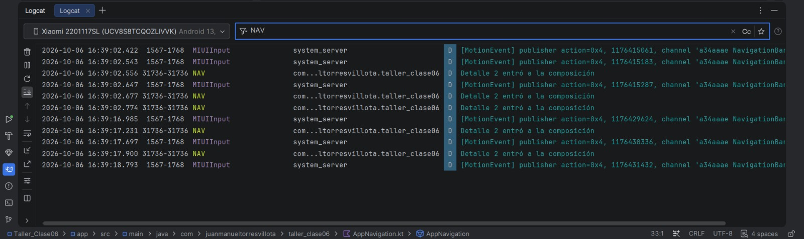
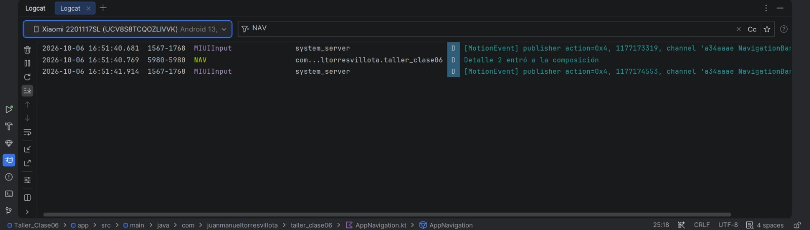
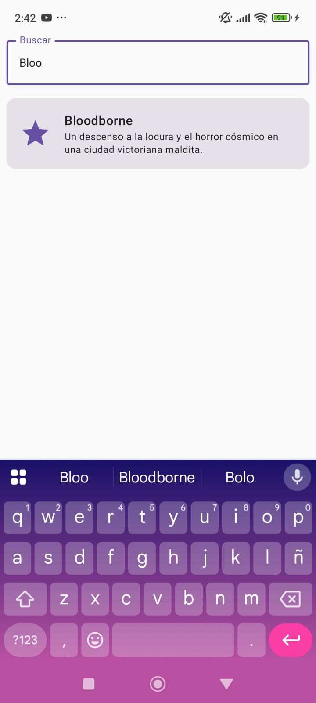
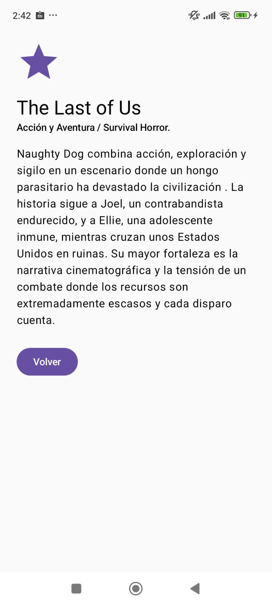

# ANALISIS — Taller 6: Lista con Navegación, Búsqueda y una Pila que No Debe Explotar

**Curso:** Programación para Dispositivos Móviles — Universidad de Caldas
**Tema de la lista:** Videojuegos favoritos

---

## 1. Predicción inicial (escrita ANTES de ejecutar el experimento)

> Si el usuario toca la MISMA tarjeta tres veces rápido antes de que cargue la pantalla de detalle, ¿cuántas veces se navegará y cuántas pantallas de detalle quedarán apiladas?

**Mi predicción:**

Predije que si se toca una tarjeta varias veces antes de que se abra el detalle, se abrirá la cantidad de veces que hayamos presionado. Es decir, con 3 toques se navegará 3 veces.

---

## 2. Evidencia del bug (Paso 3.1)

**Cómo lo reproduje:** con `launchSingleTop` desactivado (comentado), ejecuté la app en el dispositivo físico y toqué 3 veces, muy rápido, la misma tarjeta (la del elemento con id 2) antes de que terminara de aparecer la pantalla de detalle.

**Qué observé en Logcat (filtro `NAV`):**

Aparecieron 3 líneas `Detalle 2 entró a la composición` en unos 350 milisegundos (15:15:10.412, 15:15:10.655 y 15:15:10.765), una por cada toque.

- Número de toques: **3**
- Líneas en Logcat generadas por los toques: **3**
- Al presionar "Volver" no regresé a la lista, sino al mismo detalle de la tarjeta que había presionado.
- Veces que tuve que presionar "Volver" para llegar a la lista: **3** (la misma cantidad de toques).

**Las dos líneas posteriores:** en la captura aparecen dos líneas más de `Detalle 2` (15:15:13.624 y 15:15:14.719), unos segundos después. Corresponden a las presiones de "Volver": cuando se quita el detalle del tope, el detalle que estaba debajo vuelve a mostrarse y entra de nuevo a la composición. Las dos primeras presiones dejan al descubierto un detalle (2 líneas) y la tercera presión llega a la lista, que no genera línea `NAV`. Esto coincide con las 3 presiones necesarias y confirma que había 3 detalles apilados.

**Captura de pantalla (antes de la corrección):**



**¿Mi predicción coincidió con lo observado?** Sí. Predije que se abriría la cantidad de veces que presionara y así fue: 3 toques produjeron 3 navegaciones y 3 pantallas de detalle apiladas.

---

## 3. Diagnóstico técnico (Paso 3.2)

**La pila de navegación tras los 3 toques:**

```
[ detalle/2 ]   <- tope (el que se ve)
[ detalle/2 ]
[ detalle/2 ]
[ lista     ]
```

Cada vez que presiono "Volver" se quita la pantalla del tope: la 1.ª vez quedan 2 detalles, la 2.ª queda 1 detalle y a la 3.ª vez recién aparece la lista. Por eso necesité tantas presiones como toques.

**Causa técnica:**

El bug ocurre por la combinación de dos cosas:

1. `navController.navigate("detalle/$id")` **apila** un destino nuevo cada vez que se llama y no verifica si ese mismo destino ya está en el tope de la pila. Por eso 3 llamadas crean 3 entradas idénticas.
2. Entre el primer toque y el momento en que la pantalla de detalle termina de aparecer hay una transición animada, y durante ese tiempo la lista sigue visible y aceptando toques. Cada toque extra dispara otra llamada a `navigate()`.

**¿Por qué solo aparece con toques rápidos y no con un toque normal?**

Con un toque normal solo se llama a `navigate()` una vez, así que se apila un único detalle. El problema aparece cuando llegan varios toques antes de que la transición termine y la lista deje de estar disponible: se acumulan llamadas repetidas al mismo destino.

---

## 4. Corrección (Paso 3.3)

**Cambio realizado** (en `AppNavigation.kt`, dentro de `composable("lista")`):

```kotlin
onElementoClick = { id ->
    navController.navigate("detalle/$id") {
        launchSingleTop = true
    }
}
```

**Qué hace `launchSingleTop = true`:** antes de crear un destino nuevo, el controlador de navegación revisa cuál es el destino que está en el tope de la pila. Si es el mismo que se quiere abrir, no apila otra entrada encima, así que en el tope queda un solo detalle. Con esto se corrige la primera causa del bug (que `navigate()` apilaba sin verificar el tope). No cambia la segunda causa: la tarjeta sigue aceptando toques durante la transición, pero ahora esos toques extra ya no crean pantallas nuevas.

**Evidencia después de la corrección** (una sola ejecución, 3 toques rápidos sobre la misma tarjeta, detalle id 3):

- Toques: **3**
- Líneas en Logcat: **3** (`Detalle 3 entró a la composición`, a las 15:07:04.520, 15:07:04.685 y 15:07:04.805)
- Veces que presioné "Volver" para llegar a la lista: **1**

| | Antes | Después |
|---|---|---|
| Toques | 3 | 3 |
| Líneas en Logcat | 3 | 3 |
| "Volver" hasta la lista | 3 | 1 |

**Nota sobre el Logcat:** el número de líneas es el mismo antes y después, pero la pila no. Esto se debe a que el `LaunchedEffect` cuenta las veces que una entrada de detalle entra a la composición, no cuántas entradas hay en la pila. Una posible explicación es que, con `launchSingleTop`, cada toque hace que el controlador reemplace la entrada del tope por una nueva, que se vuelve a componer, y por eso cada toque deja una línea aunque la pila conserve un solo detalle. En una prueba anterior con la corrección activa vi solo 2 líneas y también bastó una presión de "Volver", por lo que el número de líneas varía según cuántos toques alcanzan a registrarse. La medida confiable de cuántas pantallas quedaron apiladas es la cantidad de presiones de "Volver": pasó de 3 a 1, lo que confirma que la corrección funciona.

**Captura de pantalla (después de la corrección):**



---

## 5. Caso límite (Paso 3.4)

**Predicción (escrita ANTES de la prueba):** pienso que `launchSingleTop` impedirá que se apilen 2 detalles distintos y que solo será necesario presionar "Volver" 1 vez para volver a la lista.

**Prueba:** tocar dos tarjetas DISTINTAS muy rápido.

**Qué ocurrió:** toqué dos tarjetas distintas muy rápido. En Logcat aparecieron dos líneas, `Detalle 3 entró a la composición` (14:16:42.048) y `Detalle 4 entró a la composición` (14:16:42.119), con unos 70 ms de diferencia. Al presionar "Volver" llegué a la lista con **1 sola presión**, es decir, no quedaron dos detalles apilados.

**¿Mi predicción coincidió?** Sí: predije que no se apilarían 2 detalles y que bastaría 1 "Volver", y así fue.

**Detalle que quedó visible al final:** el de la **segunda** tarjeta que presioné.

**¿Debería comportarse así?** Considero que no. Aunque evita apilar pantallas, el resultado final no es el que el usuario eligió primero, y para el controlador `detalle/3` y `detalle/4` son el mismo destino, por lo que el segundo reemplaza al primero. Además, si en el futuro un detalle pudiera abrir otro detalle (por ejemplo "juego relacionado"), `launchSingleTop` lo reemplazaría en vez de apilarlo y el usuario no podría volver al detalle anterior.

**Diferencia entre "mismo destino repetido" y "destinos distintos en cadena":** "Mismo destino repetido" son toques duplicados sobre lo mismo (varios toques a la misma tarjeta): son un error de interacción y `launchSingleTop` lo resuelve al no apilar copias. "Destinos distintos en cadena" es navegación legítima, donde cada pantalla es un paso diferente (lista → detalle → otra pantalla) y cada una debe quedar en la pila para poder volver. `launchSingleTop` compara el destino (la ruta), no el contenido, por eso no distingue entre dos detalles con ids distintos y los trata como el mismo destino.

---

## 6. Conclusión


Aprendí que la navegación en Compose funciona como una pila: cada `navigate()` agrega una pantalla encima y `popBackStack()` quita la de arriba. Por eso, sin ninguna protección, varios toques rápidos sobre la misma tarjeta apilaron tres detalles idénticos y fueron necesarias tres presiones de "Volver" para llegar a la lista.

`launchSingleTop = true` resolvió ese problema porque evita crear un destino nuevo cuando ya hay uno igual en el tope, y tras la corrección bastó una sola presión de "Volver". Lo que más me sorprendió fue que esta opción compara el destino (la ruta `detalle/{elementoId}`) y no el contenido: al tocar dos tarjetas distintas, el segundo detalle reemplazó al primero. Eso me mostró que corregir un bug puede introducir un comportamiento nuevo que también hay que evaluar.

También aprendí que lo que se mide importa: el contador de Logcat (que cuenta entradas que se componen) y el número de presiones de "Volver" (que mide la profundidad real de la pila) no dicen lo mismo, y la segunda es la medida más confiable de cuántas pantallas quedaron apiladas.

---

## 7. Bonus — Parte 4, Opción B: conservar la posición de scroll

Elevé el estado de la lista: `rememberLazyListState()` se crea en `AppNavigation`, por encima del `NavHost`, y se pasa a `ListaScreen` como parámetro (`listState`), donde se asigna al `LazyColumn` con `state = listState`. Como ese estado vive mientras dure la navegación, al volver desde un detalle la lista se queda en la última posición donde estaba. Lo comprobé desplazándome hacia el final de la lista, abriendo un detalle y presionando "Volver".

---

## 8. Capturas de la app

**Lista con búsqueda activa:**



**Pantalla de detalle:**


